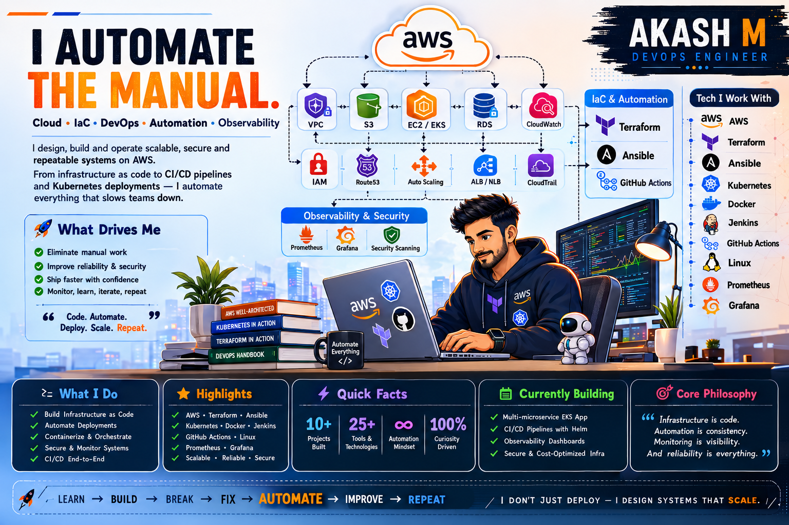

<div align="center">




# 👋 Hi, I'm AKASH M

### Cloud Engineer • DevOps Engineer • Automation Enthusiast

Building cloud infrastructure, automating deployments, and exploring cloud-native technologies through hands-on projects.

I work with AWS, Terraform, Kubernetes, Docker, Ansible, CI/CD pipelines, monitoring, and automation to build reliable and scalable infrastructure.

</div>

---

<p align="center">


</p>

---

# 🚀 About Me

I am a Cloud & DevOps Engineer passionate about designing scalable infrastructure, automating operational workflows, and improving software delivery processes.

My learning journey focuses on building real-world solutions using:

- ☁️ AWS Cloud Infrastructure
- 🏗️ Infrastructure as Code
- ☸️ Kubernetes & Container Platforms
- 🔄 CI/CD Automation
- 🔐 DevSecOps Practices
- 📊 Monitoring & Observability
- 🐧 Linux Administration
- 🤖 Python & Shell Automation

I enjoy solving infrastructure challenges, reducing manual operations through automation, and continuously improving engineering workflows.

---

# 🎯 Current Mission

```
Learn → Build → Automate → Deploy → Monitor → Improve
```

My goal is to become a well-rounded DevOps Engineer capable of designing, automating, securing, and operating production-grade cloud environments.

---

# 🏆 Featured Projects

## ☁️ CloudVerse — Cloud Native Microservices Platform

A production-style DevOps implementation demonstrating modern cloud-native deployment practices.

### Technologies Used

- AWS EKS
- Kubernetes
- Docker
- Terraform
- Jenkins
- Helm
- JFrog Artifactory
- Prometheus
- Grafana
- Trivy
- SonarQube

### Implemented:

✅ Containerized microservices  
✅ Kubernetes deployments  
✅ CI/CD automation  
✅ Docker image management  
✅ Infrastructure provisioning using Terraform  
✅ Monitoring and observability setup  
✅ Security scanning integration  


---

## 🔐 SSH Key Distribution Automation

Python-based automation tool to securely distribute SSH keys across multiple servers.

### Features

- CSV-based server inventory
- Automated connectivity checks
- SSH key distribution
- Execution reporting
- Error handling
- Automation workflow

### Technologies

- Python
- Linux
- SSH
- Bash


---

## 🏗️ 30 Days AWS + Terraform Challenge

A structured Infrastructure as Code journey focused on building AWS resources using Terraform.

### Covered:

- IAM Automation
- EC2 Provisioning
- VPC Networking
- Security Groups
- S3 Backend
- DynamoDB State Locking
- Terraform Modules
- Variables & Locals
- Terraform Import
- Git Version Control


---

# 🛠️ Technology Stack


## ☁️ Cloud Platform

<p>

</p>

Experience with:

- Amazon EC2
- Amazon VPC
- IAM
- IAM Policies
- S3
- RDS
- Lambda
- EKS
- CloudFront
- CloudWatch
- Auto Scaling Groups
- Security Groups
- Network ACLs
- Route Tables
- NAT Gateway
- VPC Peering
- AWS CLI


---

# 🏗️ Infrastructure as Code

<p>

</p>

Experience with:

- Terraform Providers
- Terraform Variables
- Terraform Locals
- Terraform Modules
- Remote State Management
- S3 Backend
- DynamoDB Locking
- Terraform Import
- Infrastructure Provisioning
- Ansible Playbooks
- Ansible Roles
- Inventory Management
- AWS Dynamic Inventory


---

# ☸️ Containers & Kubernetes

<p>

</p>

Hands-on experience with:

- Docker Images
- Dockerfile Optimization
- Docker Compose
- Container Networking
- Amazon EKS
- Kubernetes Pods
- Deployments
- Services
- ConfigMaps
- Secrets
- Namespaces
- Labels & Selectors
- Ingress
- Helm Charts
- Metrics Server
- Network Policies
- Persistent Volumes
- EBS CSI Driver


---

# 🔄 CI/CD & Automation

<p>

</p>

Experience with:

- Jenkins Pipelines
- Scripted Pipelines
- Declarative Pipelines
- GitHub Actions
- AWS CodePipeline
- AWS CodeBuild
- Automated Builds
- Docker Image Publishing
- Kubernetes Deployments
- Release Automation


---

# 📦 Artifact Management

Experience with:

- JFrog Artifactory
- Docker Registry
- Image Versioning
- Artifact Storage
- Credential Management


---

# 📊 Monitoring & Observability

<p>

</p>

Experience with:

- Prometheus
- Grafana
- Metrics Collection
- Dashboard Creation
- Infrastructure Monitoring
- Application Observability
- Alerting Concepts


---

# 🔐 DevSecOps & Security Tools

Experience with:

- Trivy
- Syft
- Grype
- Checkov
- OWASP ZAP
- IAM Security Practices
- Kubernetes Security Concepts
- Secrets Management
- Vulnerability Scanning


---

# 🐧 Operating Systems & Programming

<p>

</p>

Experience with:

- Linux Administration
- Ubuntu
- Bash Scripting
- Shell Automation
- SSH
- Process Management
- Networking Commands
- Python Automation Scripts


---

# 🗄️ Databases

<p>

</p>

Experience with:

- MySQL
- PostgreSQL
- MongoDB
- Amazon RDS
- Database Connectivity Troubleshooting


---

# 📈 Learning Roadmap

| Domain | Progress |
|---|---|
| AWS Cloud Infrastructure | ██████████ |
| Linux Administration | ██████████ |
| Git & GitHub | ██████████ |
| Terraform | ██████████ |
| Docker | ██████████ |
| Kubernetes | ██████████ |
| Ansible | █████████░ |
| Jenkins CI/CD | ████████░░ |
| Helm | ███████░░░ |
| Monitoring | ███████░░░ |
| DevSecOps | ███████░░░ |
| Python Automation | ███████░░░ |


---

# 🔥 Currently Exploring

- Advanced Terraform Modules
- Kubernetes Networking
- Helm Chart Development
- GitOps Workflows
- AWS Security Best Practices
- Cloud Cost Optimization
- Platform Engineering
- Infrastructure Automation
- Production Monitoring Strategies


---

# ⚙️ Engineering Principles

> Infrastructure should be reproducible.

> Automation should eliminate repetitive work.

> Security should be integrated from the beginning.

> Monitoring provides visibility and confidence.

> Documentation is part of engineering.


---

# 📊 GitHub Analytics

<p align="center">
  
  
</p>

<p align="center">
  
</p>

---

# 🏆 GitHub Achievements

<p align="center">
  
</p>

---

# 📂 Repository Categories

## ☁️ Cloud Infrastructure

- AWS Projects
- Terraform Modules
- Infrastructure Automation


## ☸️ Kubernetes

- Kubernetes Deployments
- Services
- Ingress
- Helm Experiments


## 🔧 Automation

- Python Automation Scripts
- Ansible Playbooks
- Shell Utilities


## 🔄 CI/CD

- Jenkins Pipelines
- GitHub Actions
- Deployment Automation


---

# 📫 Connect With Me

<p>

<a href="https://github.com/Akash-M21">


</a>

</p>


---

<div align="center">

### 🚀 Building Cloud Skills One Commit at a Time


</div>
